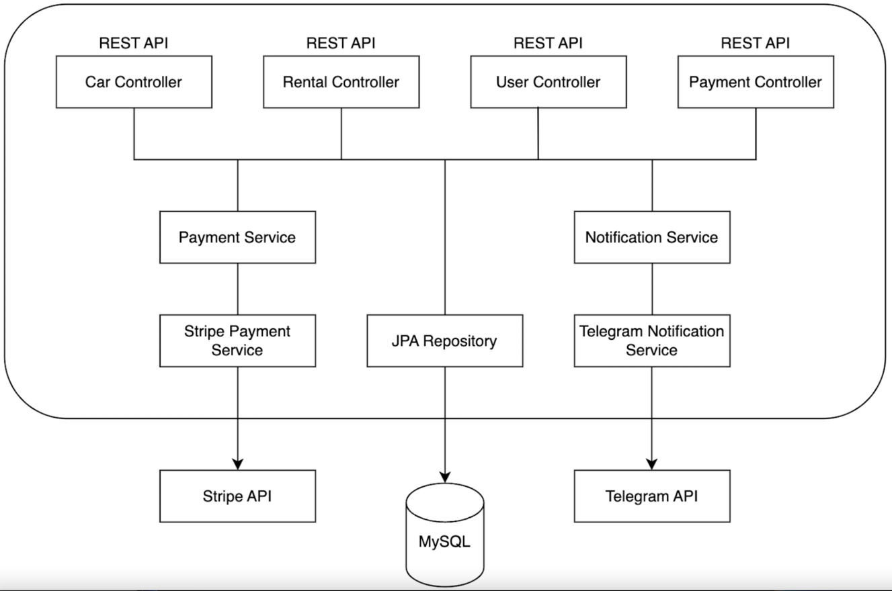
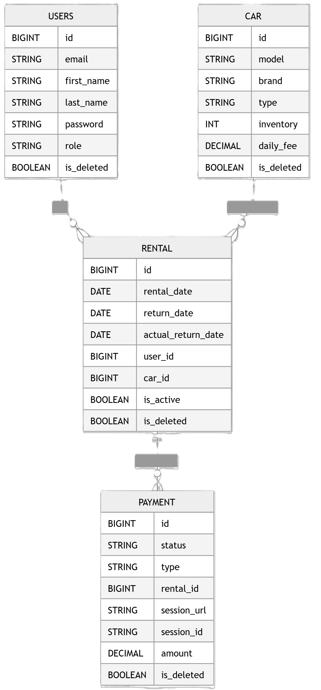

# Car Sharing API

## Table of Contents

- [Project Overview](#project-overview)
- [Technologies Used](#technologies-used)
- [Architecture](#architecture)
- [Project Structure](#project-structure)
- [Authentication](#authentication)
- [Endpoints](#endpoints)
- [Database Schema](#database-schema)
- [How to Run Locally](#how-to-run-locally)
- [API Documentation](#api-documentation)
- [Postman Examples](#postman-examples)
- [Contact](#contact)

---

## Project Overview

**Car Sharing API** is a Spring Boot REST application with JWT-based authentication.  
It allows **customers** to register, rent and return cars, and make payments, while **admins** can manage cars, users,
and track payments.

The system includes:

- Automatic daily checks for overdue rentals
- Telegram notifications for new rentals, payments, and overdue rentals
- Stripe integration for payment processing

---

## Technologies Used

- **Java 17**
- **Spring Boot** (Web, Security, Data JPA)
- **Spring Security**
- **MySQL**
- **Liquibase**
- **MapStruct**
- **Docker**
- **JWT (JSON Web Token)**
- **Stripe API**
- **Telegram API**
- **Swagger**
- 
---

## Architecture

The application follows a layered architecture:



### Additional Components

- **Security Layer → JWT authentication & authorization**
- **Scheduler Layer → automatic overdue rental detection**
- **External Integrations → Stripe payments, Telegram notifications**
- **API Documentation Layer → Swagger (SpringDoc OpenAPI)**

---

## Project Structure

```
src/
├── main/
│ ├── java/carsharing/carsharingservice/
│ │ ├── config/ → Application configuration
│ │ ├── controller/ → REST API endpoints
│ │ ├── dto/ → Data Transfer Objects
│ │ ├── exception/ → Custom exceptions
│ │ ├── healthcheck/ → Health check implementation
│ │ ├── mapper/ → MapStruct mappers
│ │ ├── model/ → Entity classes
│ │ ├── repository/ → JPA repositories
│ │ ├── scheduler/ → Scheduled tasks (overdue rentals)
│ │ ├── security/ → JWT authentication and authorization
│ │ ├── service/ → Business logic
│ │ └── validation/ → Custom validators
│ └── CarSharingServiceApplication.java
├── resources/
│ ├── db/changelog/ → Liquibase changelogs
│ └── application.properties
```

---

## Authentication

The API uses JWT-based authentication with Spring Security.

Authentication is handled through /api/auth endpoints and secured using role-based access control.

### Authentication Flow

1. User registers via:
    - `POST /api/auth/register`
2. User logs in via:
    - `POST /api/auth/login`
3. Server returns a JWT token
4. Client must include the token in every secured request

### Roles

The system uses the following roles:

1. **CUSTOMER:**
   - rent cars
   - return rentals
   - make payments
   - manage personal profile
2. **MANAGER:**
   - full system access
   - manage cars
   - manage users and roles
   - view all rentals and payments

### Security Model

- Endpoints are protected using @PreAuthorize
- Authentication is handled via Spring Security Authentication object
- JWT token is used to build authenticated user context
- User identity is extracted from authentication.getPrincipal()

---

## Endpoints

### Available for all users

| Method | Endpoint             | Description                 |
|--------|----------------------|-----------------------------|
| GET    | `/api/cars`          | List available cars         |
| POST   | `/api/auth/register` | Register new user           |
| POST   | `/api/auth/login`    | Authenticate user & get JWT |

### Available for registered users

| Method | Endpoint                   | Description                |
|--------|----------------------------|----------------------------|
| GET    | `/api/rentals/{id}`        | Get rental by ID           |
| GET    | `/api/users/me`            | Get personal info          |
| GET    | `/api/payments/success`    | Stripe success redirect    |
| GET    | `/api/payments/cancel`     | Stripe cancel redirect     |
| GET    | `/api/rentals`             | Get rentals (with filters) |
| POST   | `/api/rentals`             | Rent a car                 |
| POST   | `/api/rentals/{id}/return` | Return a car               |
| PATCH  | `/api/users/me`            | Update profile info        |
| POST   | `/api/payments`            | Make payment               |

### Available for admin users

| Method | Endpoint                               | Description                     |
|--------|----------------------------------------|---------------------------------|
| GET    | `/api/cars/{id}`                       | Get car by ID                   |
| GET    | `/api/rentals?userId=...&isActive=...` | Get rentals by user ID & status |
| GET    | `/api/payments?user_id=...`            | Get payments by user ID         |
| POST   | `/api/cars`                            | Add new car                     |
| PUT    | `/api/users/{id}/role`                 | Update user role                |
| PATCH  | `/api/cars/{id}`                       | Update car info                 |
| DELETE | `/api/cars/{id}`                       | Delete car                      |

### Health Check

| Method | Endpoint             | Description                        |
|--------|----------------------|------------------------------------|
| GET    | `/api/memory-health` | Get memory usage and health status |

> **Note:** All `POST`, `PUT`, and `PATCH` endpoints require JSON body.

---

## Database Schema

System uses a relational database with four main entities: User, Car, Rental, and Payment.



---

###  Relationships
- A user can have many rentals (1:N)
- A car can be assigned to many rentals (1:N)
- A rental can have multiple payments (1:N)

---

## How to Run Locally

1. Make sure you have installed:
   - Java 17+
   - Docker & Docker Compose
2. Configure Environment Variables
   - create a .env file in the root directory and populate it with the environment variables as defined in the .env.sample file
3. Run the Application with Docker 
   - build and start all services: docker-compose up --build
4. The application will be available at: http://localhost:8081


## API Documentation
<http://localhost:8081/swagger-ui/index.html>


## Postman Examples

- **Register:** Provide email, password, name, surname.
- **Add a New Car (Admin Only):** Provide model, brand, type, inventory, daily fee.
- **Get Rentals by Status (Admin Only):** Parameter `isActive=true` for active, `false` for returned.
- **Pay for Rental:** Provide rental ID and payment type; response includes Stripe payment link.
- **Get Payments by User ID (Admin Only):** Provide `userId` parameter.

---

## Video Representation
<https://youtu.be/p1TUqOvCCKE>

## Contact

- **Developer**: Oleksii Babych
- **Email**:   obabych1@stu.vistula.edu.pl
- **GitHub**: <https://github.com/Oleksii21th/CarSharingService>
